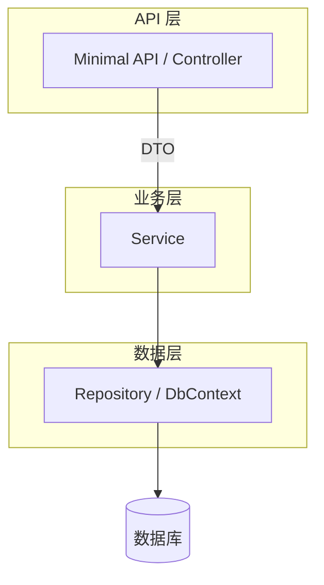

# ASP.NET Core API 开发

> 关键词：Minimal API、Controller、REST、OpenAPI、ProblemDetails | 前置知识：`aspnet-core-overview.md`、HTTP 方法与状态码 | 难度：入门

## 概述

**API**（Application Programming Interface，应用程序接口）在这里指：前端通过 HTTP 调用后端的一组 URL。**REST**（Representational State Transfer）是一种设计风格：用 URL 表示资源，用 HTTP 方法表示动作（GET 查、POST 建、PUT 改、DELETE 删）。

ASP.NET Core 有两种常见写法：

| 写法 | 适合场景 |
|------|----------|
| **Minimal API** | 小服务、原型、微服务；代码集中在 `Program.cs` |
| **Controller API** | 大项目、复杂校验与 Filter；类文件结构清晰 |

无论哪种，都应：**URL 表资源、状态码表结果、错误格式统一**。

## 核心概念

| 概念 | 通俗解释 | 正式说明 |
|------|----------|----------|
| Minimal API | 几行代码直接绑定 URL 和处理函数 | `MapGet` / `MapPost` 等扩展方法 |
| Controller | 一个类管一类资源的所有接口 | 带 `[ApiController]` 和路由特性的类 |
| DTO（Data Transfer Object） | 专门用来传输的数据形状，和数据库表分开 | 请求/响应模型，避免暴露内部结构 |
| Model Binding（模型绑定） | 框架自动把 URL/Query/Body 填到参数里 | `[FromQuery]`、`[FromBody]` 等 |
| Validation（校验） | 检查必填、长度、格式 | Data Annotations 或 FluentValidation |
| ProblemDetails | 标准错误 JSON 格式（RFC 7807） | ASP.NET Core 内置，`400/404/500` 等可统一结构 |

### 分层类比（餐厅）

| 层 | 角色 | 职责 |
|----|------|------|
| API 层 | 前台 | 接单、核对、上菜、说「没有这道菜」(404) |
| Service 层 | 厨房 | 业务规则：库存够不够、价格怎么算 |
| Repository 层 | 仓库 | 取货、存货；不管 HTTP |



## 示例

### Minimal API：商品 CRUD

```csharp
// 注册业务服务（Scoped：每个 HTTP 请求一份）
builder.Services.AddScoped<IProductService, ProductService>();

var app = builder.Build();

// MapGroup：给一组路由加共同前缀 /api/v1/products
var products = app.MapGroup("/api/v1/products").WithTags("Products");

// GET /api/v1/products?page=1&size=20 — 列表（Query 参数有默认值）
products.MapGet("/", async (IProductService svc, int page = 1, int size = 20) =>
{
    var result = await svc.ListAsync(page, size);
    return Results.Ok(result);  // 200 + JSON
});

// GET /api/v1/products/42 — 按 id 查；找不到返回 404
products.MapGet("/{id:int}", async (int id, IProductService svc) =>
{
    var item = await svc.GetByIdAsync(id);
    return item is null ? Results.NotFound() : Results.Ok(item);
});

// POST /api/v1/products — 新建；成功返回 201 和 Location 头
products.MapPost("/", async (CreateProductRequest req, IProductService svc) =>
{
    var created = await svc.CreateAsync(req);
    return Results.Created($"/api/v1/products/{created.Id}", created);
});
```

**逐步讲解：**

1. `MapGroup` 避免每个路由重复写 `/api/v1/products`。
2. `IProductService svc` 由 DI 自动注入，Endpoint 里不写业务细节。
3. `{id:int}` 表示路由段必须是整数，否则 404。
4. `Results.Created` 对应 HTTP **201 Created**，并带上新资源的 URL。

### API 契约（前后端约定）

```json
// POST /api/v1/products
// 请求体 Body：要创建的商品
{ "name": "Keyboard", "price": 299.00 }

// 成功 201：系统分配 id
{ "id": 42, "name": "Keyboard", "price": 299.00 }

// 校验失败 400：ProblemDetails 格式
{
  "type": "https://tools.ietf.org/html/rfc9110#section-15.5.1",
  "title": "One or more validation errors occurred.",
  "status": 400,
  "errors": { "Name": ["The Name field is required."] }
}
```

### Controller API 等价写法

```csharp
[ApiController]                              // 启用自动模型校验、绑定规则
[Route("api/v1/[controller]")]               // [controller] 替换为 Products
public class ProductsController : ControllerBase
{
    private readonly IProductService _svc;

    // 构造函数注入 Service
    public ProductsController(IProductService svc) => _svc = svc;

    [HttpGet]                                  // GET api/v1/products
    public async Task<ActionResult<PagedResult<ProductDto>>> List(
        [FromQuery] int page = 1,              // 来自 ?page=1
        [FromQuery] int size = 20)
        => Ok(await _svc.ListAsync(page, size));

    [HttpGet("{id:int}")]
    public async Task<ActionResult<ProductDto>> Get(int id)
    {
        var item = await _svc.GetByIdAsync(id);
        return item is null ? NotFound() : Ok(item);
    }

    [HttpPost]
    public async Task<ActionResult<ProductDto>> Create([FromBody] CreateProductRequest req)
    {
        var created = await _svc.CreateAsync(req);
        // CreatedAtAction 自动生成 Location 指向 Get
        return CreatedAtAction(nameof(Get), new { id = created.Id }, created);
    }
}
```

**逐步讲解：**

1. `[ApiController]` 让非法模型自动返回 400，不用手写 if。
2. `[FromQuery]` / `[FromBody]` 标明参数从哪来。
3. `ActionResult<T>` 既可以是 200 的 T，也可以是 NotFound 等。
4. Controller 与 Minimal API **可以共存**于同一项目。

### 全局错误处理

```csharp
builder.Services.AddProblemDetails();  // 注册标准错误体服务
app.UseExceptionHandler();           // 捕获未处理异常
app.UseStatusCodePages();            // 把空 404 等变成 ProblemDetails
```

## 实践步骤

1. 团队选定 Minimal API 或 Controller，全项目风格一致
2. 启用 Swagger：`AddEndpointsApiExplorer()` + `AddSwaggerGen()`
3. 实现 CRUD → 分页 Query → 字段校验 → 全局异常
4. 用 curl / Postman 测边界：空 body、非法 id、重复提交
5. 导出 `swagger.json` 给前端生成 TypeScript 客户端

## 常见误区

- ❌ URL 用动词 `/api/getProducts` → ✅ 资源名 `/api/v1/products`，动作用 HTTP 方法
- ❌ 所有情况都返回 200，错误放在 `{ "success": false }` → ✅ 用 4xx/5xx + ProblemDetails
- ❌ 直接把数据库实体返回给前端（含密码、导航循环引用）→ ✅ 映射为 DTO
- ❌ POST 支付/下单无幂等设计 → ✅ 用 Idempotency-Key 或唯一业务键防重复
- ❌ Minimal API 单文件堆几百行业务 → ✅ 超过约 30 行抽到 Service

## 选型建议

| 场景 | 推荐 |
|------|------|
| 微服务、内部工具、快速原型 | Minimal API |
| 大型 API、复杂 Filter/授权 | Controller |
| 部分模块简单、部分复杂 | 两者混用 |

## 与其他领域的关联

- **前端**：OpenAPI 生成客户端；CORS 见 `middleware-pipeline.md`
- **数据库**：Service 调 EF Core，见 `entity-framework-core.md`
- **安全**：JWT 保护写接口，见 `authentication-jwt.md`
- **测试**：`WebApplicationFactory` 发 HTTP 集成测试

## 参考资源

- [Minimal APIs 概述](https://learn.microsoft.com/aspnet/core/fundamentals/minimal-apis/overview)
- [Web API Controller](https://learn.microsoft.com/aspnet/core/web-api/)
- [ProblemDetails 错误处理](https://learn.microsoft.com/aspnet/core/web-api/handle-errors)
- [Swagger / OpenAPI](https://learn.microsoft.com/aspnet/core/tutorials/web-api-help-pages-using-swagger)

## 延伸阅读

- 同目录：`validation-and-pagination.md`、`dependency-injection.md`、`entity-framework-core.md`、`authentication-jwt.md`
- 跨目录：`../README.md`
