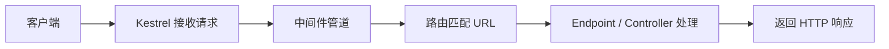

# ASP.NET Core 概览

> 关键词：ASP.NET Core、Kestrel、Host、WebApplication | 前置知识：HTTP 是什么、URL 与 JSON | 难度：入门

## 概述

**ASP.NET Core**（ASP.NET Core，微软开源的 Web 框架）用来写后端 API：浏览器或 App 发 HTTP 请求，服务器处理后返回 JSON。

生活类比：ASP.NET Core 像一家**标准化餐厅的总调度系统**——负责开门营业（启动服务器）、接待客人（接收请求）、安排传菜顺序（中间件）、把订单交给厨房（业务代码），最后把菜端出去（HTTP 响应）。

与旧版 ASP.NET 不同，ASP.NET Core **跨平台**（Windows / Linux / macOS），模块化、性能好，是当前 .NET 新项目的主流选择。

## 核心概念

| 概念 | 通俗解释 | 正式说明 |
|------|----------|----------|
| Host（宿主） | 整个应用的「大管家」，负责启动、配置、关闭 | 应用生命周期容器，整合 DI、日志、配置与 Web 服务器 |
| Kestrel | 真正「听电话」的人，在端口上接收 HTTP | 跨平台内置 Web 服务器；生产环境常配合 Nginx/IIS 做反向代理 |
| WebApplication | .NET 6+ 推荐的程序入口，一个对象搞定注册与启动 | 封装服务注册与 HTTP 管道配置的入口类型 |
| Middleware Pipeline（中间件管道） | 请求要经过的多道安检/加工工序 | 按注册顺序串联的 `RequestDelegate` 链 |
| Dependency Injection（依赖注入，DI） | 需要啥工具跟框架「报个名」，框架自动递给你 | 内置 IoC 容器，按生命周期创建并注入依赖 |
| Configuration（配置） | 不同环境用不同「设置表」，不用改代码 | 支持 `appsettings.json`、环境变量、命令行等多源配置 |

## 项目结构

```text
MyApi/
├── Program.cs              # 程序入口：注册服务、配置管道、启动
├── appsettings.json        # 默认配置（如连接字符串）
├── appsettings.Development.json  # 开发环境专用配置
├── MyApi.csproj            # 项目文件（依赖包、目标框架）
├── Properties/
│   └── launchSettings.json # 本地调试时的端口、环境名
├── Controllers/            # Controller 风格 API（可选）
├── Services/               # 业务逻辑
├── Data/                   # 数据库上下文、仓储
└── Models/                 # 请求/响应模型、数据库实体
```

## 示例

### 创建并运行最小 API

```powershell
# 创建项目；-o 指定输出文件夹
dotnet new webapi -n HelloApi -o HelloApi --use-minimal-apis
cd HelloApi
dotnet run
```

### Program.cs 最小入口

```csharp
// WebApplication.CreateBuilder：创建应用的「建造者」，args 是命令行参数
var builder = WebApplication.CreateBuilder(args);

// 注册 Swagger（开发时看接口文档用的工具）
builder.Services.AddEndpointsApiExplorer();
builder.Services.AddSwaggerGen();

// Build() 把配置好的服务组装成可运行的 app
var app = builder.Build();

// 只在开发环境启用 Swagger，生产环境不暴露接口文档
if (app.Environment.IsDevelopment())
{
    app.UseSwagger();
    app.UseSwaggerUI();
}

// MapGet：把 GET /health 映射到一个处理函数；返回 JSON
app.MapGet("/health", () => Results.Ok(new { status = "ok" }));

// 开始监听端口，等待 HTTP 请求
app.Run();
```

**逐步讲解：**

1. `CreateBuilder` 创建应用骨架，后续在 `builder.Services` 上注册各种服务（数据库、业务类等）。
2. `AddSwaggerGen` 让开发时能打开 `/swagger` 查看接口列表。
3. `app.Build()` 之后配置「管道」——请求进来后经过哪些中间件。
4. `MapGet("/health", ...)` 定义：当有人访问 `GET /health` 时，返回 `{ "status": "ok" }`。
5. `app.Run()` 阻塞运行，直到你按 Ctrl+C 停止。

访问 `GET http://localhost:端口/health`，应看到：

```json
{ "status": "ok" }
```

## 请求处理流程



## 实践步骤

1. 安装 [.NET SDK](https://dotnet.microsoft.com/download)（建议 LTS 版本）
2. 执行 `dotnet new webapi`，打开 `Program.cs` 和 `Properties/launchSettings.json`，找到本地端口
3. 添加 `/health` 端点，用浏览器或 `curl http://localhost:端口/health` 验证
4. 设置环境变量 `ASPNETCORE_ENVIRONMENT=Development` 与 `Production`，观察 Swagger 是否只在开发环境出现
5. 继续阅读同目录 `dependency-injection.md`、`middleware-pipeline.md`

## 常见误区

- ❌ 把所有业务逻辑都写在 `Program.cs` 的 lambda 里 → ✅ 抽到 Service 类，Endpoint 只做参数绑定和返回
- ❌ 生产环境直接把 Kestrel 暴露在公网、不配 HTTPS → ✅ 前面加 Nginx/IIS 做 TLS 和限流
- ❌ 混淆 .NET Framework（老 Windows 框架）与 .NET / ASP.NET Core → ✅ 新项目统一用 .NET 8+ 与 ASP.NET Core
- ❌ 忽略环境名 Development / Production → ✅ 数据库连接、Swagger、详细错误页按环境区分

## 与其他领域的关联

- **前端**：通过 REST + JSON 通信；跨域（CORS）在中间件里配置，见 `middleware-pipeline.md`
- **数据库**：通过 EF Core 访问，见 `entity-framework-core.md`
- **部署**：`dotnet publish` 打包，配合 Docker/K8s，见 `deployment/` 目录
- **测试**：`WebApplicationFactory` 做集成测试，见 `testing/` 目录

## 参考资源

- [ASP.NET Core 官方文档](https://learn.microsoft.com/aspnet/core/)
- [.NET 下载与版本策略](https://dotnet.microsoft.com/download)
- [Kestrel Web 服务器](https://learn.microsoft.com/aspnet/core/fundamentals/servers/kestrel)

## 延伸阅读

- 同目录：`configuration-and-logging.md`、`api-development.md`、`dependency-injection.md`、`middleware-pipeline.md`
- 跨目录：`../README.md`
