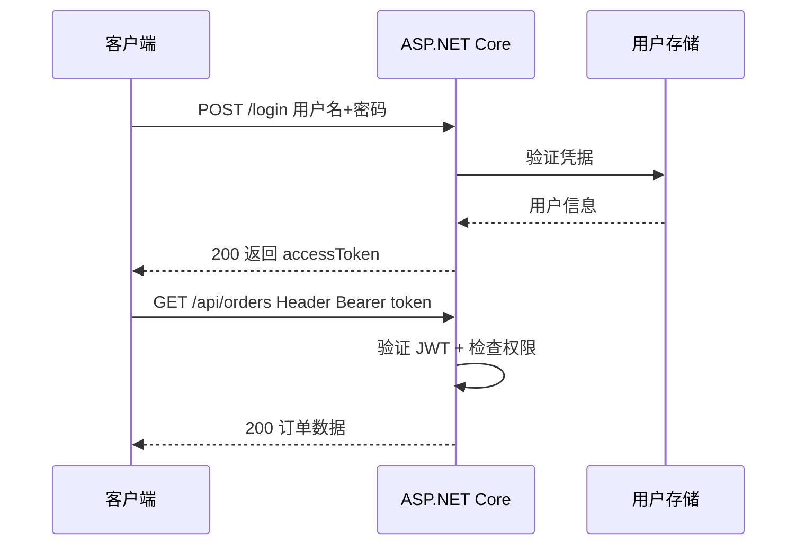

# ASP.NET Core JWT 认证与授权

> 关键词：JWT、Bearer、Authentication、Authorization、RBAC | 前置知识：HTTP Header、HTTPS、`middleware-pipeline.md` | 难度：进阶

## 概述

**认证**（Authentication，AuthN）回答「**你是谁**」——通常用用户名密码登录。**授权**（Authorization，AuthZ）回答「**你能做什么**」——例如只有管理员能删用户。

**JWT**（JSON Web Token，一种紧凑的令牌格式）常用于无状态 API：登录成功后服务器签发一串字符，客户端之后每次请求在 Header 里带上 `Authorization: Bearer <token>`，服务器验证签名即可，不必在服务器存 Session。

生活类比：JWT 像**游乐园手环**——进门时验票给你戴手环（登录签发 Token），玩每个项目工作人员只看手环颜色和等级（Claims / Role），不用每次查身份证。

## 核心概念

| 概念 | 通俗解释 | 正式说明 |
|------|----------|----------|
| Claim（声明） | 手环上印的信息，如用户 id、角色 | 键值对，如 `sub`、`role` |
| JWT | 三段 Base64 拼成的令牌：头.载荷.签名 | Header.Payload.Signature |
| Bearer | 「谁拿着令牌谁就是持有者」的 HTTP 认证方案 | `Authorization: Bearer xxx` |
| `[Authorize]` | 这个接口必须登录才能访问 | 框架内置特性 |
| Policy / Role | 更细的权限规则，如必须 Admin 角色 | 基于角色或自定义策略的授权 |
| 401 vs 403 | 没登录 vs 登录了但权限不够 | Unauthorized vs Forbidden |



## 示例

### 安装与配置

```powershell
dotnet add package Microsoft.AspNetCore.Authentication.JwtBearer
```

```json
// appsettings.json — 开发用；生产密钥放环境变量
{
  "Jwt": {
    "Issuer": "https://api.example.com",
    "Audience": "https://app.example.com",
    "Key": "至少32字符的随机密钥-生产勿提交仓库",
    "ExpireMinutes": 60
  }
}
```

```csharp
// Program.cs
builder.Services.AddAuthentication(JwtBearerDefaults.AuthenticationScheme)
    .AddJwtBearer(options =>
    {
        var jwt = builder.Configuration.GetSection("Jwt");
        options.TokenValidationParameters = new TokenValidationParameters
        {
            ValidateIssuer = true,           // 检查签发者
            ValidateAudience = true,       // 检查受众
            ValidateLifetime = true,       // 检查是否过期
            ValidateIssuerSigningKey = true,
            ValidIssuer = jwt["Issuer"],
            ValidAudience = jwt["Audience"],
            IssuerSigningKey = new SymmetricSecurityKey(
                Encoding.UTF8.GetBytes(jwt["Key"]!))
        };
    });

builder.Services.AddAuthorization(options =>
{
    options.AddPolicy("AdminOnly", policy => policy.RequireRole("Admin"));
});

// 管道顺序：Authentication 必须在 Authorization 之前
app.UseAuthentication();
app.UseAuthorization();
```

**逐步讲解：**

1. `AddAuthentication` 注册 JWT 为默认认证方案。
2. `TokenValidationParameters` 定义「什么样的 Token 算合法」。
3. `AddPolicy` 定义除角色外的自定义授权规则。
4. 中间件顺序见 `middleware-pipeline.md`。

### 登录接口：验证密码并签发 Token

```csharp
public record LoginRequest(string Username, string Password);
public record TokenResponse(string AccessToken, int ExpiresIn);

app.MapPost("/api/auth/login", async (
    LoginRequest req,
    IUserService users,
    IOptions<JwtSettings> jwtOptions) =>
{
    // 1. 查用户、验密码（密码应哈希存储，见下方生产建议）
    var user = await users.ValidateAsync(req.Username, req.Password);
    if (user is null)
        return Results.Unauthorized();  // 401

    var settings = jwtOptions.Value;

    // 2. 把用户信息放进 Claims（不要放密码！）
    var claims = new[]
    {
        new Claim(JwtRegisteredClaimNames.Sub, user.Id.ToString()),
        new Claim(JwtRegisteredClaimNames.UniqueName, user.Username),
        new Claim(ClaimTypes.Role, user.Role)
    };

    // 3. 用密钥签名
    var key = new SymmetricSecurityKey(Encoding.UTF8.GetBytes(settings.Key));
    var creds = new SigningCredentials(key, SecurityAlgorithms.HmacSha256);
    var expires = DateTime.UtcNow.AddMinutes(settings.ExpireMinutes);

    var token = new JwtSecurityToken(
        issuer: settings.Issuer,
        audience: settings.Audience,
        claims: claims,
        expires: expires,
        signingCredentials: creds);

    var tokenString = new JwtSecurityTokenHandler().WriteToken(token);
    return Results.Ok(new TokenResponse(tokenString, settings.ExpireMinutes * 60));
});
```

**逐步讲解：**

1. 登录失败统一 401，不要透露「用户名不存在还是密码错」（防枚举用户）。
2. Claims 只放必要信息；JWT Payload 只是 Base64，**可被解码**，勿放敏感数据。
3. `expires` 必须设置；客户端可根据 `expiresIn` 决定何时刷新。

### 保护 API

```csharp
// Minimal API：整组需要 Admin 角色
var admin = app.MapGroup("/api/admin").RequireAuthorization("AdminOnly");
admin.MapGet("/users", async (IUserService svc) => await svc.ListAsync());

// Controller
[Authorize(Roles = "Admin")]
[HttpGet("users")]
public async Task<ActionResult<IEnumerable<UserDto>>> ListUsers()
    => Ok(await _svc.ListAsync());
```

### 契约示例

```json
// POST /api/auth/login
{ "username": "alice", "password": "secret" }

// 成功 200
{ "accessToken": "eyJhbG...", "expiresIn": 3600 }

// GET /api/admin/users
// Header: Authorization: Bearer eyJhbG...
// 无 Token → 401
// Token 有效但非 Admin → 403
```

## 生产环境建议

| 主题 | 建议 |
|------|------|
| 密钥 | 环境变量 / Azure Key Vault，禁止提交 Git |
| HTTPS | 生产强制 HTTPS，防 Token 被窃听 |
| 过期时间 | Access Token 短（15–60 分钟）；Refresh Token 放 HttpOnly Cookie 或数据库轮换 |
| 撤销 | 无状态 JWT 难即时作废；敏感操作用短过期 + Refresh 或黑名单 |
| 密码 | ASP.NET Core Identity + PBKDF2，数据库只存哈希，绝不明文 |

## 实践步骤

1. 配置 `JwtSettings`；Development 与 Production 使用不同密钥
2. 实现 `/api/auth/login`，Swagger 里添加 Bearer 安全定义
3. 给管理接口加 `RequireAuthorization("AdminOnly")` 或 `[Authorize(Roles = "Admin")]`
4. 用 Postman/curl 测试：无 Token、过期 Token、错误 Role
5. 前端：登录后存 Token，请求拦截器附加 Header；收到 401 跳转登录

## 常见误区

- ❌ 只写 `UseAuthorization` 不写 `UseAuthentication` → ✅ 两个都要，且顺序正确
- ❌ JWT 里存密码、信用卡号 → ✅ Payload 可解码，只放 id、role 等
- ❌ `ValidateLifetime = false` → ✅ 必须验证过期
- ❌ 密钥硬编码在源码 → ✅ 配置外置 + 足够长度随机串
- ❌ 未登录返回 403 → ✅ 未登录 **401**，已登录无权限 **403**

## 与其他领域的关联

- **中间件**：AuthN/AuthZ 在管道中的位置，见 `middleware-pipeline.md`
- **前端**：Axios/fetch 拦截器附加 Token，见 `frontend/` 目录
- **数据库**：用户表、角色表、Refresh Token 表
- **API 设计**：登录、刷新、登出接口契约，见 `api-development.md`

## 参考资源

- [ASP.NET Core 认证概览](https://learn.microsoft.com/aspnet/core/security/authentication/)
- [JWT Bearer 配置](https://learn.microsoft.com/aspnet/core/security/authentication/jwt-authn)
- [授权策略](https://learn.microsoft.com/aspnet/core/security/authorization/policies)
- [ASP.NET Core Identity](https://learn.microsoft.com/aspnet/core/security/authentication/identity)

## 延伸阅读

- 同目录：`middleware-pipeline.md`、`api-development.md`、`integration-testing.md`
- 跨目录：`../README.md`
