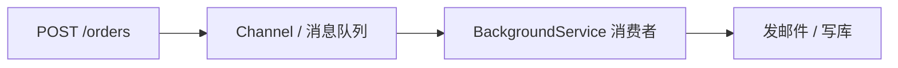

# ASP.NET Core 后台服务

> 关键词：IHostedService、BackgroundService、Queue、定时任务 | 前置知识：`dependency-injection.md` | 难度：进阶

## 概述

HTTP 请求适合**快问快答**；发邮件、生成报表、同步外部数据等**耗时任务**不应让用户一直等。应把任务丢进**后台**（Background Service，随应用一起运行的长期任务）或**消息队列**异步处理。

生活类比：顾客点外卖后拿到**取餐号**（接口立即返回「已受理」），厨房**后台**慢慢做；不用站在柜台等到菜做好。

## 核心概念

| 概念 | 通俗解释 | 正式说明 |
|------|----------|----------|
| IHostedService | 随应用启动/停止的后台任务契约 | `StartAsync` / `StopAsync` |
| BackgroundService | 微软提供的基类，简化循环任务 | 继承后实现 `ExecuteAsync` |
| Hosted Service | 注册在 DI 里的后台服务 | `AddHostedService<T>()` |
| 通道 Channel | 内存队列，生产者/消费者模式 | `System.Threading.Channels` |
| 定时执行 | 每隔一段时间跑一轮 | `PeriodicTimer` 或 NCronJob/Hangfire |

## 示例

### 简单定时任务

```csharp
// Services/HeartbeatBackgroundService.cs
public class HeartbeatBackgroundService : BackgroundService
{
    private readonly ILogger<HeartbeatBackgroundService> _logger;

    public HeartbeatBackgroundService(ILogger<HeartbeatBackgroundService> logger)
    {
        _logger = logger;
    }

    protected override async Task ExecuteAsync(CancellationToken stoppingToken)
    {
        // PeriodicTimer：.NET 6+ 推荐的定时器，Dispose 友好
        using var timer = new PeriodicTimer(TimeSpan.FromMinutes(1));

        while (await timer.WaitForNextTickAsync(stoppingToken))
        {
            _logger.LogInformation("后台心跳 {Time}", DateTimeOffset.UtcNow);
            // 这里可以：清理过期数据、同步状态、健康探针等
        }
    }
}

// Program.cs
builder.Services.AddHostedService<HeartbeatBackgroundService>();
```

**逐步讲解：**

1. `BackgroundService` 继承 `IHostedService`，`ExecuteAsync` 在后台线程跑。
2. `stoppingToken` 在应用关闭时取消，循环应尊重它以便优雅退出。
3. `AddHostedService` 注册为 Singleton，**不要**在构造函数注入 Scoped 服务（如 DbContext）。

### 在 Scoped 里用 DbContext：开 Scope

```csharp
public class CleanupBackgroundService : BackgroundService
{
    private readonly IServiceScopeFactory _scopeFactory;
    private readonly ILogger<CleanupBackgroundService> _logger;

    public CleanupBackgroundService(
        IServiceScopeFactory scopeFactory,
        ILogger<CleanupBackgroundService> logger)
    {
        _scopeFactory = scopeFactory;
        _logger = logger;
    }

    protected override async Task ExecuteAsync(CancellationToken stoppingToken)
    {
        using var timer = new PeriodicTimer(TimeSpan.FromHours(1));

        while (await timer.WaitForNextTickAsync(stoppingToken))
        {
            // 每次任务创建独立 Scope，Scoped 服务（DbContext）才安全
            await using var scope = _scopeFactory.CreateAsyncScope();
            var db = scope.ServiceProvider.GetRequiredService<AppDbContext>();

            var expired = await db.RefreshTokens
                .Where(t => t.ExpiresAt < DateTime.UtcNow)
                .ExecuteDeleteAsync(stoppingToken);

            _logger.LogInformation("清理过期 Token {Count} 条", expired);
        }
    }
}
```

**逐步讲解：**

1. 后台服务是 Singleton，不能直接注入 `AppDbContext`（Scoped）。
2. `IServiceScopeFactory.CreateAsyncScope()` 手动开「小请求范围」。
3. 任务结束 Scope 释放，DbContext 连接归还池。

### API 触发 + Channel 队列（推荐模式）

```csharp
// 队列接口与实现
public interface IEmailQueue
{
    ValueTask QueueAsync(EmailMessage message);
    ValueTask<EmailMessage> DequeueAsync(CancellationToken ct);
}

public class EmailQueue : IEmailQueue
{
    private readonly Channel<EmailMessage> _channel =
        Channel.CreateUnbounded<EmailMessage>();

    public async ValueTask QueueAsync(EmailMessage message)
        => await _channel.Writer.WriteAsync(message);

    public async ValueTask<EmailMessage> DequeueAsync(CancellationToken ct)
        => await _channel.Reader.ReadAsync(ct);
}

public record EmailMessage(string To, string Subject, string Body);

// 消费者后台服务
public class EmailBackgroundService : BackgroundService
{
    private readonly IEmailQueue _queue;
    private readonly ILogger<EmailBackgroundService> _logger;

    public EmailBackgroundService(IEmailQueue queue, ILogger<EmailBackgroundService> logger)
    {
        _queue = queue;
        _logger = logger;
    }

    protected override async Task ExecuteAsync(CancellationToken stoppingToken)
    {
        while (!stoppingToken.IsCancellationRequested)
        {
            var msg = await _queue.DequeueAsync(stoppingToken);
            // 实际发送邮件（调用 SMTP 或第三方 API）
            _logger.LogInformation("发送邮件至 {To} 主题 {Subject}", msg.To, msg.Subject);
            await Task.Delay(100, stoppingToken);  // 模拟 IO
        }
    }
}

// Program.cs
builder.Services.AddSingleton<IEmailQueue, EmailQueue>();
builder.Services.AddHostedService<EmailBackgroundService>();

// API：立即返回 202，邮件后台发
app.MapPost("/api/orders", async (CreateOrderRequest req, IOrderService orders, IEmailQueue emailQueue) =>
{
    var order = await orders.CreateAsync(req);
    await emailQueue.QueueAsync(new EmailMessage(
        req.Email, "订单确认", $"订单 {order.Id} 已创建"));
    return Results.Accepted($"/api/orders/{order.Id}", order);
});
```

**逐步讲解：**

1. API 只负责入队，响应快（**202 Accepted** 表示已接受、处理中）。
2. `Channel` 是进程内队列；应用重启会丢队列内未处理项。
3. 生产多实例或需持久化时，改用 **RabbitMQ / Azure Service Bus / MassTransit**。



## 与 Hangfire / Quartz 选型

| 方案 | 适用 |
|------|------|
| BackgroundService + Channel | 单实例、轻量异步、学习成本低 |
| Hangfire / Quartz.NET | 需要持久化、Dashboard、Cron 表达式 |
| MassTransit + RabbitMQ | 多服务、可靠投递、削峰 |

## 实践步骤

1. 添加 `HeartbeatBackgroundService`，运行后每分钟看日志
2. 实现 `CleanupBackgroundService`，用 `IServiceScopeFactory` 访问 DbContext
3. 注册 `EmailQueue` + 消费者，POST 接口返回 202
4. 停止应用（Ctrl+C），确认后台循环因 `stoppingToken` 退出而非强杀
5. 评估：单实例 Channel 够用否；不够则调研消息队列

## 常见误区

- ❌ 在 API 里 `await SendEmail()` 阻塞用户 30 秒 → ✅ 入队 + 后台处理
- ❌ Singleton 后台服务构造函数注入 DbContext → ✅ `IServiceScopeFactory` 开 Scope
- ❌ 死循环不检查 `stoppingToken` → ✅ 关闭应用时无法优雅停机
- ❌ 进程内队列当「可靠消息」→ ✅ 重启丢消息，重要业务用持久化队列
- ❌ 无限并行 `Task.Run` 不限制 → ✅ 控制并发（SemaphoreSlim 或队列单消费者）

## 与其他领域的关联

- **API**：202 Accepted、幂等，见 `api-development.md`
- **依赖注入**：Scope 与生命周期，见 `dependency-injection.md`
- **部署**：多副本时 Channel 不共享，需外部队列，见 `deployment/`

## 参考资源

- [BackgroundService](https://learn.microsoft.com/aspnet/core/fundamentals/host/hosted-services)
- [System.Threading.Channels](https://learn.microsoft.com/dotnet/core/extensions/channels)
- [MassTransit 文档](https://masstransit.io/)

## 延伸阅读

- 同目录：`api-development.md`、`dependency-injection.md`
- 跨目录：`deployment/` 容器化与水平扩展
