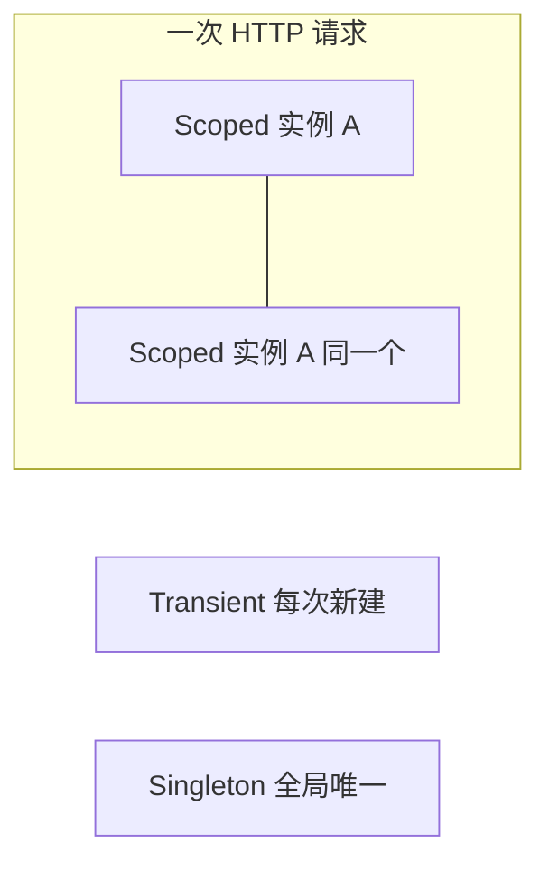

# ASP.NET Core 依赖注入

> 关键词：Dependency Injection、IoC、Service Lifetime、IServiceCollection | 前置知识：接口与类、构造函数 | 难度：入门

## 概述

**依赖注入**（Dependency Injection，简称 DI）的意思是：**你需要什么对象，在构造函数里「声明」，框架在运行时自动创建并传进来**，而不是自己在代码里 `new`。

生活类比：你是厨师（Service），需要刀和砧板（Repository、Logger）。DI 像**厨房后勤**——你报菜单（构造函数参数），后勤按规则准备好递给你；换一把刀（测试时换成 Mock）也不用改你的炒菜流程。

ASP.NET Core **内置 DI 容器**，是框架的一等公民。用好 DI 可以：层与层解耦、方便单元测试、统一管理对象「活多久」（生命周期）。

## 核心概念

| 概念 | 通俗解释 | 正式说明 |
|------|----------|----------|
| IoC 容器 | 专门「造对象、塞依赖」的工厂 | Inversion of Control 容器，ASP.NET Core 默认实现 |
| 注册（Register） | 告诉框架「接口 X 用实现 Y，活多久」 | 在 `IServiceCollection`（即 `builder.Services`）上调用 `AddXxx` |
| 解析（Resolve） | 框架按注册表自动 `new` 并注入 | 创建 Controller/Endpoint/中间件时解析构造函数依赖 |
| Constructor Injection | 通过构造函数参数要依赖（推荐） | 唯一推荐的注入方式，依赖一目了然 |
| 生命周期 | 这个对象「活一次请求还是活整个应用」 | Transient / Scoped / Singleton 三种 |

### 三种生命周期

| 生命周期 | 注册方法 | 通俗解释 | 典型用途 |
|----------|----------|----------|----------|
| Transient（瞬态） | `AddTransient` | 每次要都现做一个新的 | 无状态小工具类 |
| Scoped（作用域） | `AddScoped` | 一次 HTTP 请求里共用同一个 | DbContext、业务 Service |
| Singleton（单例） | `AddSingleton` | 整个应用只有一份 | 配置缓存、HttpClient 工厂 |



## 示例

### 接口、实现与注册

```csharp
// 1. 定义接口：对外承诺「能按 id 查商品」
public interface IProductService
{
    Task<ProductDto?> GetByIdAsync(int id);
}

// 2. 实现类：构造函数声明需要 IProductRepository 和日志
public class ProductService : IProductService
{
    private readonly IProductRepository _repo;
    private readonly ILogger<ProductService> _logger;

    // 框架会自动传入已注册的具体实现
    public ProductService(IProductRepository repo, ILogger<ProductService> logger)
    {
        _repo = repo;
        _logger = logger;
    }

    public Task<ProductDto?> GetByIdAsync(int id) => _repo.GetByIdAsync(id);
}

// 3. Program.cs 里注册：接口 → 实现，Scoped = 每个请求一份
builder.Services.AddScoped<IProductRepository, ProductRepository>();
builder.Services.AddScoped<IProductService, ProductService>();
```

**逐步讲解：**

1. `IProductService` 是「合同」，Controller 只依赖接口，不依赖具体类。
2. `ProductService` 构造函数列出依赖，**不要**在方法里 `new ProductRepository()`。
3. `AddScoped` 表示同一 HTTP 请求内，`ProductService` 和 `ProductRepository` 各创建一次并复用。
4. Minimal API 或 Controller 构造函数写 `IProductService svc`，框架自动注入。

### 选项模式（Options Pattern）

把 `appsettings.json` 里的配置绑成强类型类，避免魔法字符串：

```csharp
// 对应 appsettings.json 里的 "Jwt" 节
public class JwtSettings
{
    public const string SectionName = "Jwt";
    public string Issuer { get; set; } = "";
    public string Key { get; set; } = "";
}

// 注册：把配置节绑定到 JwtSettings
builder.Services.Configure<JwtSettings>(
    builder.Configuration.GetSection(JwtSettings.SectionName));

// 使用：注入 IOptions<JwtSettings>，取 .Value
public class TokenService
{
    private readonly JwtSettings _settings;
    public TokenService(IOptions<JwtSettings> options) => _settings = options.Value;
}
```

**逐步讲解：**

1. `JwtSettings` 属性名要和 JSON 字段对应（大小写不敏感）。
2. `Configure<T>` 把配置读进 DI，换环境只改配置文件。
3. `IOptions<T>` 适合启动后不变的配置；热更新可用 `IOptionsSnapshot<T>`。

### HttpClient 正确注册

```csharp
// ❌ 不要：new HttpClient() 或 AddSingleton<HttpClient>() — 易耗尽连接、DNS 不更新
// ✅ 使用 IHttpClientFactory（工厂帮你管理连接池）
builder.Services.AddHttpClient<IExternalApiClient, ExternalApiClient>(client =>
{
    client.BaseAddress = new Uri("https://api.example.com/");
    client.Timeout = TimeSpan.FromSeconds(10);
});
```

## 实践步骤

1. 业务类面向接口：`IXxxService`、`IXxxRepository`
2. 在 `Program.cs` 或扩展方法 `AddApplicationServices()` 里**集中注册**，方便查找
3. 数据库 `AddDbContext` 默认 Scoped，**不要**改成 Singleton
4. 写单元测试时，用 Mock 实现替换 `AddScoped<IProductService, FakeProductService>()`
5. 若启动报「无法解析服务」，检查是否忘记注册，或出现循环依赖 A→B→A

## 常见误区

- ❌ Singleton 里注入 Scoped 服务（Captive Dependency）→ ✅ Singleton 只依赖 Singleton；需要 Scoped 时用 `IServiceScopeFactory` 手动开 Scope
- ❌ 在 `ConfigureServices` 里 `BuildServiceProvider()` 提前解析 → ✅ 交给框架在请求时解析
- ❌ 到处 `GetRequiredService`（Service Locator）→ ✅ 构造函数声明依赖
- ❌ DbContext 注册成 Singleton → ✅ 必须 Scoped，与请求同生命周期
- ❌ 所有类都 Singleton 图省事 → ✅ 有请求状态或 DbContext 的用 Scoped

## 与其他领域的关联

- **API 层**：Controller / Minimal API 通过构造函数拿 Service，见 `api-development.md`
- **数据库**：`AddDbContext<AppDbContext>`，见 `entity-framework-core.md`
- **中间件**：`UseMiddleware<T>` 时容器会解析 T 的构造函数，见 `middleware-pipeline.md`
- **测试**：测试项目里替换 DI 注册，见 `testing/` 目录

## 参考资源

- [依赖注入官方文档](https://learn.microsoft.com/aspnet/core/fundamentals/dependency-injection)
- [服务生命周期](https://learn.microsoft.com/aspnet/core/fundamentals/dependency-injection#service-lifetimes)
- [HttpClient 工厂](https://learn.microsoft.com/aspnet/core/fundamentals/http-requests)

## 延伸阅读

- 同目录：`configuration-and-logging.md`、`api-development.md`、`entity-framework-core.md`、`background-services.md`
- 跨目录：`testing/` 中的 Mock 与集成测试
