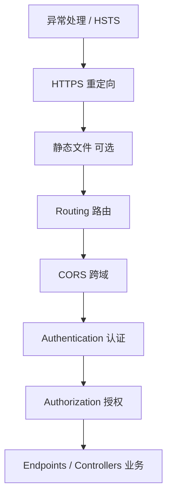

# ASP.NET Core 中间件管道

> 关键词：Middleware、Pipeline、Use/Run/Map、CORS | 前置知识：`aspnet-core-overview.md`、HTTP 请求与响应 | 难度：入门

## 概述

**中间件**（Middleware）是 ASP.NET Core 处理每个 HTTP 请求的「流水线工序」。请求从 Kestrel 进来后，依次经过多个中间件：每个中间件可以检查、修改请求/响应，也可以**短路**（不再往后传，直接返回，比如未登录返回 401）。

生活类比：进机场要**安检 → 验票 → 登机口**；中间件就是这几道关卡。**顺序很重要**：先验身份再决定能不能进贵宾室。

## 核心概念

| 概念 | 通俗解释 | 正式说明 |
|------|----------|----------|
| Request Delegate | 处理「一个请求」的函数 | 类型 `(HttpContext context) => Task` |
| Pipeline（管道） | 所有中间件排成的队 | 按 `Program.cs` 注册顺序串联 |
| 短路（Short-circuit） | 到此为止，不再往后传 | 不调用 `next()`，直接写响应 |
| 分支（Branching） | 不同 URL 走不同子管道 | `Map`、`MapWhen` 按路径或条件分流 |
| HttpContext | 当前请求的「手提箱」，装着请求和响应 | 贯穿整个管道，中间件共享 |

## 推荐管道顺序



| 顺序 | 中间件 | 为什么这样排 |
|------|--------|--------------|
| 最前 | 异常处理 | 捕获后面任何环节抛出的错误 |
| Routing 之后 | CORS、Auth | 路由先确定「去哪个 Endpoint」 |
| AuthN 在 AuthZ 前 | 先认证再授权 | 先知道「你是谁」，再判断「你能干啥」 |
| 最后 | MapControllers / MapGet | 真正执行业务代码 |

## 示例

### 典型 Program.cs 管道配置

```csharp
var app = builder.Build();

// 生产环境统一捕获异常，返回友好错误（或 ProblemDetails）
app.UseExceptionHandler("/error");

// 把 http 请求重定向到 https
app.UseHttpsRedirection();

// 启用路由：后面才能用 Endpoint 元数据
app.UseRouting();

// 跨域：允许指定前端域名调用 API
app.UseCors("AllowFrontend");

// 认证：解析 JWT/Cookie，填充 HttpContext.User
app.UseAuthentication();

// 授权：检查 [Authorize]、Policy 是否满足
app.UseAuthorization();

// 映射 Controller 或 Minimal API 端点
app.MapControllers();

app.Run();
```

**逐步讲解：**

1. `UseExceptionHandler` 包住后续管道，未捕获异常不会直接 500 裸奔。
2. `UseRouting` 之后，`UseAuthentication` 才知道当前匹配哪个 Endpoint。
3. **必须先 `UseAuthentication` 再 `UseAuthorization`**，否则授权没有用户信息。
4. `MapControllers` 是管道终点之一，匹配到的 Action 在这里执行。

### CORS 跨域配置

浏览器从 `https://app.example.com` 访问 `https://api.example.com` 时，会先问服务器「允不允许跨域」：

```csharp
// 1. 注册名为 AllowFrontend 的策略
builder.Services.AddCors(options =>
{
    options.AddPolicy("AllowFrontend", policy =>
        policy.WithOrigins("https://app.example.com")  // 只允许这个前端域名
              .AllowAnyHeader()   // 允许任意请求头
              .AllowAnyMethod()   // 允许 GET/POST/PUT/DELETE 等
              .AllowCredentials()); // 允许带 Cookie/凭证
});

// 2. 管道里启用该策略（名字要一致）
app.UseCors("AllowFrontend");
```

**逐步讲解：**

1. CORS 是**浏览器**的安全机制；Postman/curl 不受此限制。
2. 带 Cookie 时不能写 `AllowAnyOrigin()`，必须指定具体域名。
3. 预检请求 OPTIONS 也要能过 CORS，所以 CORS 通常放在 Auth 之前。

### 自定义中间件（记录请求耗时）

```csharp
// 推荐：类 + 扩展方法，支持 DI 注入 ILogger
public class RequestTimingMiddleware
{
    private readonly RequestDelegate _next;  // 管道中的「下一个」中间件
    private readonly ILogger<RequestTimingMiddleware> _logger;

    public RequestTimingMiddleware(RequestDelegate next, ILogger<RequestTimingMiddleware> logger)
    {
        _next = next;
        _logger = logger;
    }

    public async Task InvokeAsync(HttpContext context)
    {
        var sw = Stopwatch.StartNew();
        await _next(context);  // 必须调用，否则后续管道不执行
        sw.Stop();
        _logger.LogInformation("{Method} {Path} {Ms}ms",
            context.Request.Method, context.Request.Path, sw.ElapsedMilliseconds);
    }
}

// 扩展方法：写法更整洁
public static class RequestTimingExtensions
{
    public static IApplicationBuilder UseRequestTiming(this IApplicationBuilder app)
        => app.UseMiddleware<RequestTimingMiddleware>();
}

// Program.cs 中使用
app.UseRequestTiming();
```

**逐步讲解：**

1. 构造函数注入 `RequestDelegate next`，表示「下一道工序」。
2. `await _next(context)` 把请求交给后面；返回后再写日志，即「往返耗时」。
3. `UseMiddleware<T>` 会从 DI 解析 T 的构造函数（如 `ILogger`）。

## 实践步骤

1. 打开项目 `Program.cs`，按上文顺序对照检查
2. Development 开 Swagger，Production 关 Swagger 并开 `UseExceptionHandler`
3. 加请求日志中间件，记录 Method、Path、StatusCode、耗时
4. 用真实前端跨域调用，确认 OPTIONS 预检和带 Token 请求都正常
5. 未登录访问受保护接口，应返回 **401** 而不是 404（若是 404，多半是路由或 Auth 顺序问题）

## 常见误区

- ❌ `UseAuthorization` 写在 `UseAuthentication` 前面 → ✅ 先 AuthN 再 AuthZ
- ❌ CORS 同时 `AllowAnyOrigin` 和 `AllowCredentials` → ✅ 带凭证必须指定 Origin
- ❌ 自定义中间件忘记 `await next()` → ✅ 不调用则 Endpoint 永远不会执行
- ❌ 在 Singleton 中间件里直接注入 Scoped DbContext → ✅ 通过 `Invoke` 注入 Scoped 服务，框架会为每请求创建 Scope
- ❌ 生产环境不配置 `ForwardedHeaders` 却在反向代理后面 → ✅ Nginx 转发时需识别 `X-Forwarded-For` 等头

## 与其他领域的关联

- **安全**：JWT 认证是中间件，见 `authentication-jwt.md`
- **API**：Endpoint 是管道终端；MVC 还有 Filter 另一种横切方式，见 `api-development.md`
- **前端**：CORS 解决浏览器跨域；见 `frontend/` 目录
- **部署**：Nginx 反向代理 + HTTPS，见 `deployment/` 目录

## 参考资源

- [中间件官方文档](https://learn.microsoft.com/aspnet/core/fundamentals/middleware/)
- [中间件顺序说明](https://learn.microsoft.com/aspnet/core/fundamentals/middleware/#middleware-order)
- [CORS](https://learn.microsoft.com/aspnet/core/security/cors)

## 延伸阅读

- 同目录：`authentication-jwt.md`、`api-development.md`、`configuration-and-logging.md`
- 跨目录：`deployment/` 反向代理与 HTTPS
