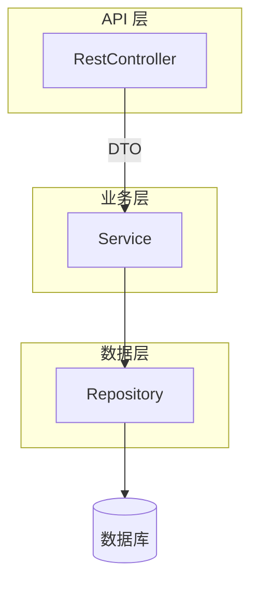

# Spring Boot REST API 开发

> 关键词：RestController、ResponseEntity、DTO、@ControllerAdvice | 前置知识：`dependency-injection.md`、HTTP 方法 | 难度：入门

## 概述

**REST API** 用 URL 表示资源，用 HTTP 方法表示动作。Spring Boot 里用 **`@RestController`** 写 JSON 接口，配合 **Service / Repository** 分层。

生活类比：**前台（Controller）**只接单和上菜；**厨房（Service）**算价、扣库存；**仓库（Repository）**拿货。

## 核心概念

| 概念 | 通俗解释 | 正式说明 |
|------|----------|----------|
| @RestController | 返回 JSON 的控制器 | @Controller + @ResponseBody |
| @RequestMapping | 路由前缀 | 常与 @GetMapping 等组合 |
| DTO | 对外传输的数据形状 | 与 Entity 分离 |
| ResponseEntity | 可指定状态码、Header 的响应 | `ok()`、`created()`、`notFound()` |
| @ControllerAdvice | 全局异常、统一响应 | 配合 @ExceptionHandler |

## 分层



| 层 | 职责 | 不应做 |
|----|------|--------|
| Controller | 路由、参数绑定、HTTP 状态码 | 复杂业务、直接 JDBC |
| Service | 业务规则、事务边界 | 解析 HttpServletRequest |
| Repository | 持久化 | 返回 ResponseEntity |

## 示例

### CRUD Controller

```java
@RestController
@RequestMapping("/api/v1/products")
public class ProductController {

    private final ProductService productService;

    public ProductController(ProductService productService) {
        this.productService = productService;
    }

    // GET /api/v1/products?page=0&size=20
    @GetMapping
    public Page<ProductDto> list(
            @RequestParam(defaultValue = "0") int page,
            @RequestParam(defaultValue = "20") int size) {
        return productService.list(page, size);
    }

    // GET /api/v1/products/42
    @GetMapping("/{id}")
    public ResponseEntity<ProductDto> get(@PathVariable Long id) {
        return productService.findById(id)
            .map(ResponseEntity::ok)
            .orElse(ResponseEntity.notFound().build());
    }

    // POST /api/v1/products
    @PostMapping
    public ResponseEntity<ProductDto> create(@Valid @RequestBody CreateProductRequest req) {
        ProductDto created = productService.create(req);
        // 201 + Location 头
        URI location = URI.create("/api/v1/products/" + created.id());
        return ResponseEntity.created(location).body(created);
    }

    // PUT /api/v1/products/42
    @PutMapping("/{id}")
    public ResponseEntity<ProductDto> update(
            @PathVariable Long id,
            @Valid @RequestBody UpdateProductRequest req) {
        return productService.update(id, req)
            .map(ResponseEntity::ok)
            .orElse(ResponseEntity.notFound().build());
    }

    // DELETE /api/v1/products/42
    @DeleteMapping("/{id}")
    @ResponseStatus(HttpStatus.NO_CONTENT)  // 204 无 body
    public void delete(@PathVariable Long id) {
        productService.delete(id);
    }
}
```

**逐步讲解：**

1. `@PathVariable` 绑定 URL 段；`@RequestParam` 绑定 Query；`@RequestBody` 绑定 JSON body。
2. `@Valid` 触发 Bean Validation，失败默认 400（见 `validation-and-pagination.md`）。
3. 创建成功用 **201 Created** 并带 Location，符合 HTTP 语义。

### API 契约

```json
// POST /api/v1/products
{ "name": "Keyboard", "price": 299.00 }

// 201
{ "id": 42, "name": "Keyboard", "price": 299.00 }

// 400 校验失败
{
  "timestamp": "2026-07-07T08:00:00Z",
  "status": 400,
  "error": "Bad Request",
  "message": "Validation failed",
  "fieldErrors": [
    { "field": "name", "message": "must not be blank" }
  ]
}
```

### 全局异常处理

```java
@RestControllerAdvice
public class GlobalExceptionHandler {

    @ExceptionHandler(MethodArgumentNotValidException.class)
    @ResponseStatus(HttpStatus.BAD_REQUEST)
    public ApiError handleValidation(MethodArgumentNotValidException ex) {
        var fieldErrors = ex.getBindingResult().getFieldErrors().stream()
            .map(f -> new FieldError(f.getField(), f.getDefaultMessage()))
            .toList();
        return new ApiError("Validation failed", fieldErrors);
    }

    @ExceptionHandler(ResourceNotFoundException.class)
    @ResponseStatus(HttpStatus.NOT_FOUND)
    public ApiError handleNotFound(ResourceNotFoundException ex) {
        return new ApiError(ex.getMessage(), List.of());
    }
}

public record ApiError(String message, List<FieldError> fieldErrors) {}
public record FieldError(String field, String message) {}
```

**逐步讲解：**

1. Service 抛 `ResourceNotFoundException`，Controller 不必每个方法 try-catch。
2. `@RestControllerAdvice` 作用于所有 `@RestController`。
3. 返回结构团队统一，前端好解析。

### OpenAPI / Swagger（可选）

```xml
<dependency>
    <groupId>org.springdoc</groupId>
    <artifactId>springdoc-openapi-starter-webmvc-ui</artifactId>
    <version>2.6.0</version>
</dependency>
```

启动后访问 `/swagger-ui.html` 查看接口文档。

## 实践步骤

1. 实现 Product CRUD 三层结构
2. 加 `@RestControllerAdvice` 统一 400/404
3. 引入 springdoc，给 DTO 字段加 `@Schema` 描述
4. 用 curl/Postman 测 201、404、400
5. 禁止 URL 动词 `/getProduct`；用名词 + HTTP 方法

## 常见误区

- ❌ Controller 返回 JPA Entity（懒加载、循环引用）→ ✅ DTO
- ❌ 所有错误 HTTP 200 + `{success:false}` → ✅ 4xx/5xx
- ❌ Service 返回 ResponseEntity → ✅ Service 返回领域对象/Optional，Controller 转 HTTP
- ❌ 无 API 版本 `/products` 将来难演进 → ✅ `/api/v1/products`

## 与其他领域的关联

- **校验分页**：见 `validation-and-pagination.md`
- **JPA**：见 `spring-data-jpa.md`
- **JWT**：见 `authentication-jwt.md`

## 参考资源

- [构建 REST 服务](https://spring.io/guides/gs/rest-service/)
- [Spring MVC](https://docs.spring.io/spring-framework/reference/web/webmvc.html)
- [springdoc-openapi](https://springdoc.org/)

## 延伸阅读

- 同目录：`validation-and-pagination.md`、`spring-data-jpa.md`
- 对照：[../csharp/api-development.md](../csharp/api-development.md)
