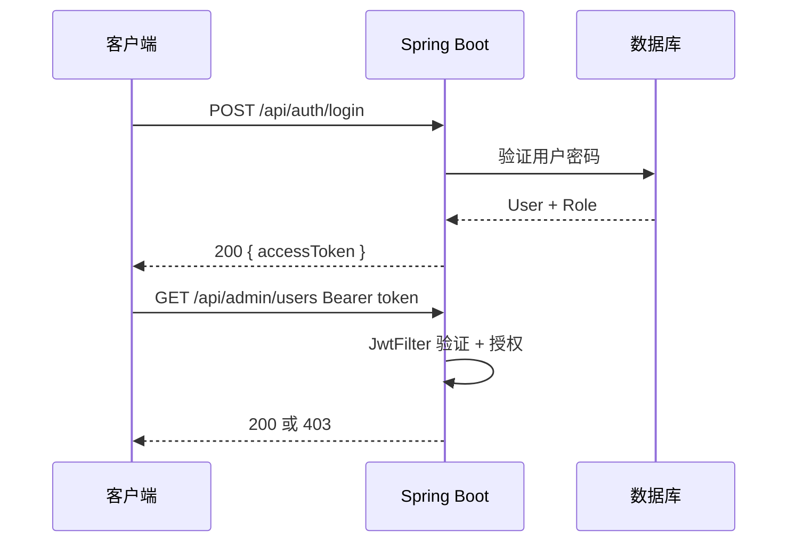

# Spring Security 与 JWT

> 关键词：Spring Security、JWT、Bearer、@PreAuthorize | 前置知识：`filters-and-interceptors.md`、HTTPS | 难度：进阶

## 概述

**Spring Security** 是 Spring 生态的**认证（Authentication）**与**授权（Authorization）**框架。**JWT**（JSON Web Token）适合前后端分离：登录后返回 Token，后续请求带 `Authorization: Bearer <token>`。

生活类比：登录领**手环**（JWT）；进每个项目看手环等级（Role/Permission）。

## 核心概念

| 概念 | 通俗解释 | 正式说明 |
|------|----------|----------|
| Authentication | 证明你是谁 | UsernamePassword、Jwt 等 |
| Authorization | 你能访问哪些资源 | Role、Authority、@PreAuthorize |
| SecurityFilterChain | Security 版「中间件链」 | HttpSecurity 配置 |
| JwtAuthenticationFilter | 解析 Bearer Token 的 Filter | 放在 UsernamePasswordAuthenticationFilter 前 |
| UserDetailsService | 按用户名加载用户 | 常与数据库 User 表配合 |
| 401 / 403 | 未认证 / 已认证无权限 | Unauthorized / Forbidden |



## 示例

### 依赖

```xml
<dependency>
    <groupId>org.springframework.boot</groupId>
    <artifactId>spring-boot-starter-security</artifactId>
</dependency>
<dependency>
    <groupId>io.jsonwebtoken</groupId>
    <artifactId>jjwt-api</artifactId>
    <version>0.12.6</version>
</dependency>
<dependency>
    <groupId>io.jsonwebtoken</groupId>
    <artifactId>jjwt-impl</artifactId>
    <version>0.12.6</version>
    <scope>runtime</scope>
</dependency>
<dependency>
    <groupId>io.jsonwebtoken</groupId>
    <artifactId>jjwt-jackson</artifactId>
    <version>0.12.6</version>
    <scope>runtime</scope>
</dependency>
```

### Security 配置

```java
@Configuration
@EnableMethodSecurity  // 启用 @PreAuthorize
public class SecurityConfig {

    private final JwtAuthenticationFilter jwtFilter;

    public SecurityConfig(JwtAuthenticationFilter jwtFilter) {
        this.jwtFilter = jwtFilter;
    }

    @Bean
    public SecurityFilterChain filterChain(HttpSecurity http) throws Exception {
        http
            .csrf(csrf -> csrf.disable())  // 无状态 JWT API 常关 CSRF；Cookie Session 则另议
            .sessionManagement(sm -> sm.sessionCreationPolicy(SessionCreationPolicy.STATELESS))
            .authorizeHttpRequests(auth -> auth
                .requestMatchers("/api/auth/**", "/health", "/swagger-ui/**").permitAll()
                .requestMatchers("/api/admin/**").hasRole("ADMIN")
                .anyRequest().authenticated()
            )
            .addFilterBefore(jwtFilter, UsernamePasswordAuthenticationFilter.class);

        return http.build();
    }

    @Bean
    public PasswordEncoder passwordEncoder() {
        return new BCryptPasswordEncoder();  // 密码哈希，不可逆
    }
}
```

**逐步讲解：**

1. `STATELESS` 表示不用服务器 Session，靠 JWT。
2. `permitAll` 的路径不需要 Token。
3. `hasRole("ADMIN")` 对应用户 Authority `ROLE_ADMIN`。

### 签发 JWT（登录）

```java
@RestController
@RequestMapping("/api/auth")
public class AuthController {

    private final AuthenticationManager authManager;
    private final JwtService jwtService;

    public AuthController(AuthenticationManager authManager, JwtService jwtService) {
        this.authManager = authManager;
        this.jwtService = jwtService;
    }

    @PostMapping("/login")
    public TokenResponse login(@Valid @RequestBody LoginRequest req) {
        // 交给 Spring Security 验证用户名密码
        Authentication auth = authManager.authenticate(
            new UsernamePasswordAuthenticationToken(req.username(), req.password()));

        String token = jwtService.generateToken(auth);
        return new TokenResponse(token, 3600);
    }
}

public record LoginRequest(
    @NotBlank String username,
    @NotBlank String password
) {}

public record TokenResponse(String accessToken, int expiresIn) {}
```

```java
@Service
public class JwtService {

    private final JwtProperties props;

    public JwtService(JwtProperties props) {
        this.props = props;
    }

    public String generateToken(Authentication auth) {
        Instant now = Instant.now();
        Instant exp = now.plusSeconds(props.expireMinutes() * 60L);

        return Jwts.builder()
            .subject(auth.getName())
            .claim("roles", auth.getAuthorities().stream()
                .map(GrantedAuthority::getAuthority).toList())
            .issuer(props.issuer())
            .issuedAt(Date.from(now))
            .expiration(Date.from(exp))
            .signWith(Keys.hmacShaKeyFor(props.secret().getBytes(StandardCharsets.UTF_8)))
            .compact();
    }
}
```

### JwtAuthenticationFilter（解析请求头）

```java
@Component
public class JwtAuthenticationFilter extends OncePerRequestFilter {

    private final JwtService jwtService;
    private final UserDetailsService userDetailsService;

    public JwtAuthenticationFilter(JwtService jwtService, UserDetailsService userDetailsService) {
        this.jwtService = jwtService;
        this.userDetailsService = userDetailsService;
    }

    @Override
    protected void doFilterInternal(HttpServletRequest request, HttpServletResponse response,
                                    FilterChain chain) throws ServletException, IOException {
        String header = request.getHeader(HttpHeaders.AUTHORIZATION);
        if (header != null && header.startsWith("Bearer ")) {
            String token = header.substring(7);
            String username = jwtService.extractUsername(token);
            if (username != null && SecurityContextHolder.getContext().getAuthentication() == null) {
                UserDetails user = userDetailsService.loadUserByUsername(username);
                if (jwtService.isTokenValid(token, user)) {
                    var authToken = new UsernamePasswordAuthenticationToken(
                        user, null, user.getAuthorities());
                    SecurityContextHolder.getContext().setAuthentication(authToken);
                }
            }
        }
        chain.doFilter(request, response);
    }
}
```

**逐步讲解：**

1. 从 `Authorization: Bearer xxx` 取 Token。
2. 验证通过后把 `Authentication` 放进 `SecurityContextHolder`，后续 `@PreAuthorize` 才能用。
3. 必须 `chain.doFilter` 继续后续 Filter。

### 保护接口

```java
@RestController
@RequestMapping("/api/admin/users")
public class AdminUserController {

    @GetMapping
    @PreAuthorize("hasRole('ADMIN')")
    public List<UserDto> list() { /* ... */ }
}
```

### 契约

```json
// POST /api/auth/login
{ "username": "alice", "password": "secret" }

// 200
{ "accessToken": "eyJhbG...", "expiresIn": 3600 }

// GET /api/admin/users
// Header: Authorization: Bearer eyJhbG...
// 无 Token → 401
// 非 Admin → 403
```

## 生产建议

| 主题 | 建议 |
|------|------|
| 密钥 | 环境变量，≥256 bit 随机 |
| HTTPS | 必须，防 Token 窃听 |
| 过期 | Access Token 短；Refresh Token 存 HttpOnly Cookie 或 DB |
| 密码 | BCrypt，数据库不存明文 |
| Payload | 勿放密码、信用卡；Payload 可 Base64 解码 |

## 实践步骤

1. 配置 `SecurityFilterChain`，放行 `/api/auth/login`
2. 实现 `UserDetailsService` 从 DB 读用户
3. 登录拿 Token，Swagger 配置 Bearer
4. 测 401、403、过期 Token
5. 生产密钥外置，`csrf` 策略按是否 Cookie 会话评估

## 常见误区

- ❌ JWT Payload 存敏感信息 → ✅ 只放 sub、roles
- ❌ 关闭 `ValidateExpiration` → ✅ 必须验证 exp
- ❌ 403/401 混用 → ✅ 未登录 401，无权限 403
- ❌ 自己解析 JWT 不用 Security 链 → ✅ 与 FilterChain 集成

## 与其他领域的关联

- **Filter 链**：见 `filters-and-interceptors.md`
- **配置**：`jwt.secret`，见 `configuration-and-logging.md`
- **JPA**：User 实体存储，见 `spring-data-jpa.md`

## 参考资源

- [Spring Security 参考](https://docs.spring.io/spring-security/reference/)
- [OAuth2 Resource Server JWT](https://docs.spring.io/spring-security/reference/servlet/oauth2/resource-server/jwt.html)

## 延伸阅读

- 同目录：`filters-and-interceptors.md`、`api-development.md`
- 对照：[../csharp/authentication-jwt.md](../csharp/authentication-jwt.md)
