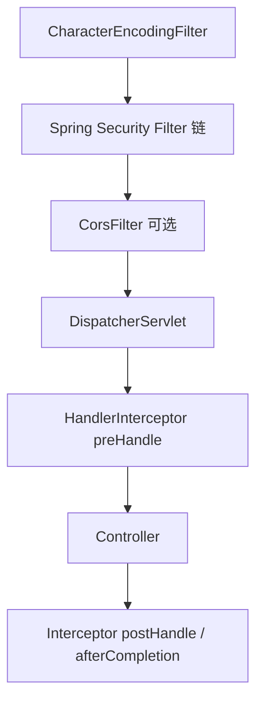

# Spring Boot Filter 与 Interceptor

> 关键词：Filter、HandlerInterceptor、CORS、Spring Security 链 | 前置知识：`spring-boot-overview.md`、HTTP | 难度：入门

## 概述

请求进入 Spring MVC 前会经过 **Filter**（Servlet 规范，最外层）；进入 DispatcherServlet 后还可经过 **HandlerInterceptor**（Spring MVC 特有）。二者做日志、鉴权、跨域等**横切**逻辑，类似 ASP.NET Core 的**中间件管道**。

生活类比：Filter 像大楼**门卫**（所有人进门先过）；Interceptor 像**楼层前台**（到了 MVC 这一层再登记）。

## 核心概念

| 概念 | 通俗解释 | 正式说明 |
|------|----------|----------|
| Filter | Servlet 层过滤器，包在 DispatcherServlet 外 | `doFilter(request, response, chain)` |
| HandlerInterceptor | MVC 层拦截器，三钩子 pre/ post/ afterCompletion | 可拿到 HandlerMethod |
| FilterRegistrationBean | 注册 Filter 并指定顺序 | `@Order` 或 `setOrder` |
| CORS | 浏览器跨域策略 | `WebMvcConfigurer.addCorsMappings` |
| OncePerRequestFilter | 保证每个请求只执行一次 | Spring 提供的 Filter 基类 |

## 推荐顺序（概念）



Security、CORS 细节见 `authentication-jwt.md`；此处关注自定义链。

## 示例

### 自定义 Filter（请求耗时）

```java
@Component
@Order(1)  // 数字越小越靠前（与其他 FilterRegistration 配合时注意）
public class TimingFilter extends OncePerRequestFilter {

    private static final Logger log = LoggerFactory.getLogger(TimingFilter.class);

    @Override
    protected void doFilterInternal(
            HttpServletRequest request,
            HttpServletResponse response,
            FilterChain filterChain) throws ServletException, IOException {

        long start = System.currentTimeMillis();
        try {
            filterChain.doFilter(request, response);  // 必须调用，否则后面不执行
        } finally {
            long ms = System.currentTimeMillis() - start;
            log.info("{} {} {}ms", request.getMethod(), request.getRequestURI(), ms);
        }
    }
}
```

**逐步讲解：**

1. `OncePerRequestFilter` 避免 forward/include 重复执行。
2. `filterChain.doFilter` 相当于「交给下一关」。
3. `finally` 里打日志，无论成功异常都记录耗时。

### HandlerInterceptor

```java
@Component
public class AuthLoggingInterceptor implements HandlerInterceptor {

    private static final Logger log = LoggerFactory.getLogger(AuthLoggingInterceptor.class);

    @Override
    public boolean preHandle(HttpServletRequest request, HttpServletResponse response, Object handler) {
        // handler 若是 HandlerMethod，可拿到 @GetMapping 等元数据
        log.debug("进入 MVC handler: {}", request.getRequestURI());
        return true;  // false 则中断，不进入 Controller
    }
}
```

```java
@Configuration
public class WebMvcConfig implements WebMvcConfigurer {

    private final AuthLoggingInterceptor authLoggingInterceptor;

    public WebMvcConfig(AuthLoggingInterceptor authLoggingInterceptor) {
        this.authLoggingInterceptor = authLoggingInterceptor;
    }

    @Override
    public void addInterceptors(InterceptorRegistry registry) {
        registry.addInterceptor(authLoggingInterceptor)
            .addPathPatterns("/api/**")      // 只拦 API
            .excludePathPatterns("/api/auth/**");  // 登录放行
    }

    @Override
    public void addCorsMappings(CorsRegistry registry) {
        registry.addMapping("/api/**")
            .allowedOrigins("https://app.example.com")
            .allowedMethods("GET", "POST", "PUT", "DELETE", "OPTIONS")
            .allowCredentials(true);
    }
}
```

**逐步讲解：**

1. Interceptor 在 **DispatcherServlet 内部**，拿不到 Filter 之前的一些底层细节，但更贴近 Controller。
2. `preHandle` 返回 false 可直接写响应并短路。
3. CORS 也可由 Spring Security 或 `CorsFilter` 处理；全局 API 用 `WebMvcConfigurer` 很常见。

### Filter vs Interceptor 选型

| 需求 | 更常用 |
|------|--------|
| 编码、压缩、最外层日志 | Filter |
| 读写 Session、与 Handler 注解配合 | Interceptor |
| JWT 鉴权、登录 | Spring Security Filter 链 |
| 静态资源 | Filter 或 WebMvc 配置 |

## 实践步骤

1. 加 `TimingFilter`，访问任意 API 看控制台耗时
2. 加 Interceptor 记录 `/api/**` 路径
3. 配置 CORS，用浏览器前端跨域调 `/api/v1/products`
4. 未登录访问受保护接口，确认 401 而非 404（Security 顺序）
5. 对照 `authentication-jwt.md` 理解 Security Filter 位置

## 常见误区

- ❌ Filter 里不调用 `chain.doFilter` → ✅ 否则 Controller 永不执行
- ❌ 在 Interceptor 里做重型 DB 操作拖慢所有请求 → ✅ 鉴权结果缓存或放 Security
- ❌ CORS `*` 与 `allowCredentials(true)` 同用 → ✅ 指定具体 Origin
- ❌ 重复造轮子忽略 Spring Security → ✅ 鉴权优先用 Security 而非手写 Filter 解析 JWT

## 与其他领域的关联

- **JWT**：Security Filter 链，见 `authentication-jwt.md`
- **API**：Controller 是链路终点，见 `api-development.md`
- **对照 .NET**：见 [../csharp/middleware-pipeline.md](../csharp/middleware-pipeline.md)

## 参考资源

- [Servlet Filters](https://docs.spring.io/spring-boot/docs/current/reference/html/web.html#web.servlet.embedded-container.servlets-filters-listeners)
- [Spring MVC Interceptor](https://docs.spring.io/spring-framework/reference/web/webmvc/mvc-config/interceptors.html)
- [CORS](https://docs.spring.io/spring-framework/reference/web/webmvc-cors.html)

## 延伸阅读

- 同目录：`authentication-jwt.md`、`api-development.md`
