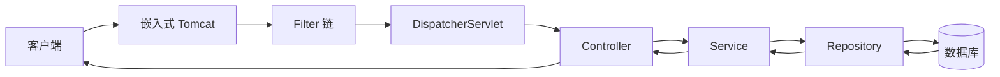

# Spring Boot 概览

> 关键词：Spring Boot、JVM、嵌入式 Tomcat、自动配置 | 前置知识：HTTP、类与对象 | 难度：入门

## 概述

**Spring Boot** 是在 **Spring Framework** 之上的「快速启动层」：少写 XML 配置，用约定和**自动配置**（Auto Configuration）帮你装好 Web 服务器、数据库连接等。

生活类比：自己搭 Web 服务器像**从零盖房**；Spring Boot 像**精装样板房**——水电（Tomcat）、门窗（JSON 序列化）都配好，你主要往里面放家具（业务代码）。

一次 HTTP 请求大致路径：**Tomcat 收请求 → Filter → DispatcherServlet → Controller → Service → Repository → 数据库 → 原路返回 JSON**。

## 核心概念

| 概念 | 通俗解释 | 正式说明 |
|------|----------|----------|
| JVM | 跑 Java 程序的「虚拟机」 | Java Virtual Machine |
| Spring | 大型应用框架，管对象创建与协作 | Spring Framework Core |
| Spring Boot | 简化 Spring 启动与配置 | 自动配置、嵌入式服务器、Starter 依赖 |
| Starter | 一组打包好的依赖，一键引入能力 | 如 `spring-boot-starter-web` |
| `@SpringBootApplication` | 程序入口上的「总开关」 | 含配置、组件扫描、自动配置 |
| 嵌入式 Tomcat | 应用自带 Web 服务器，不用单独装 | 默认监听 8080 |

## 项目结构

```text
demo/
├── pom.xml                          # Maven 依赖与构建（Gradle 则为 build.gradle）
├── src/main/java/com/example/demo/
│   ├── DemoApplication.java         # main 入口
│   ├── controller/                  # REST 接口
│   ├── service/                     # 业务逻辑
│   ├── repository/                  # 数据访问
│   ├── model/                       # 实体、DTO
│   └── config/                      # 配置类
├── src/main/resources/
│   ├── application.yml              # 配置文件
│   └── static/                      # 静态资源（可选）
└── src/test/java/                     # 测试
```

## 示例

### 入口类

```java
package com.example.demo;

import org.springframework.boot.SpringApplication;
import org.springframework.boot.autoconfigure.SpringBootApplication;

@SpringBootApplication  // 启用自动配置 + 扫描本包及子包下的 @Component
public class DemoApplication {

    public static void main(String[] args) {
        // 启动嵌入式 Tomcat 并刷新 Spring 容器
        SpringApplication.run(DemoApplication.class, args);
    }
}
```

**逐步讲解：**

1. `@SpringBootApplication` 等于 `@Configuration` + `@EnableAutoConfiguration` + `@ComponentScan`。
2. `SpringApplication.run` 启动内嵌 Tomcat，默认端口 **8080**（可在 `application.yml` 改）。
3. 同包及子包下的 `@RestController`、`@Service` 会被自动注册为 Bean。

### 最小 REST 接口

```java
package com.example.demo.controller;

import org.springframework.web.bind.annotation.GetMapping;
import org.springframework.web.bind.annotation.RestController;
import java.util.Map;

@RestController  // = @Controller + 方法返回值直接写 JSON
public class HealthController {

    @GetMapping("/health")  // 处理 GET /health
    public Map<String, String> health() {
        return Map.of("status", "ok");  // 自动序列化为 {"status":"ok"}
    }
}
```

**逐步讲解：**

1. `@GetMapping("/health")` 把 URL 和方法绑定。
2. 返回 `Map` 或 POJO 时，Spring 用 **Jackson** 转成 JSON。
3. 启动后访问 `http://localhost:8080/health` 验证。

### pom.xml 核心依赖（Maven）

```xml
<!-- Spring Web：REST + 嵌入式 Tomcat + Jackson -->
<dependency>
    <groupId>org.springframework.boot</groupId>
    <artifactId>spring-boot-starter-web</artifactId>
</dependency>
```

## 请求处理流程



## 实践步骤

1. 在 [start.spring.io](https://start.spring.io/) 生成项目，只勾 Spring Web
2. 添加上面 `HealthController`，`mvn spring-boot:run` 启动
3. 浏览器访问 `/health`，确认 JSON 响应
4. 打开 `application.yml`，设置 `server.port: 9090`，体会配置生效
5. 继续阅读 `configuration-and-logging.md`、`dependency-injection.md`

## 常见误区

- ❌ 把 Spring Boot 等同于 Java 全部 → ✅ 它是 Java 生态里的一种 Web 框架
- ❌ Controller 里写大量业务与 SQL → ✅ 分层：Controller 薄、Service 厚
- ❌ 组件类不在入口包子包下却扫不到 → ✅ 调整 `@ComponentScan` 或移动包结构
- ❌ 生产仍用 H2 内存库 → ✅ 换 PostgreSQL/MySQL 并配置连接池

## 与其他领域的关联

- **配置**：`application.yml`，见 `configuration-and-logging.md`
- **数据库**：Spring Data JPA，见 `spring-data-jpa.md`
- **部署**：打 jar `java -jar app.jar`，见 `deployment/` 目录

## 参考资源

- [Spring Boot 参考文档](https://docs.spring.io/spring-boot/docs/current/reference/html/)
- [Spring Boot 入门指南](https://spring.io/guides/gs/spring-boot/)

## 延伸阅读

- 同目录：`configuration-and-logging.md`、`api-development.md`
- 对照：[../csharp/aspnet-core-overview.md](../csharp/aspnet-core-overview.md)
