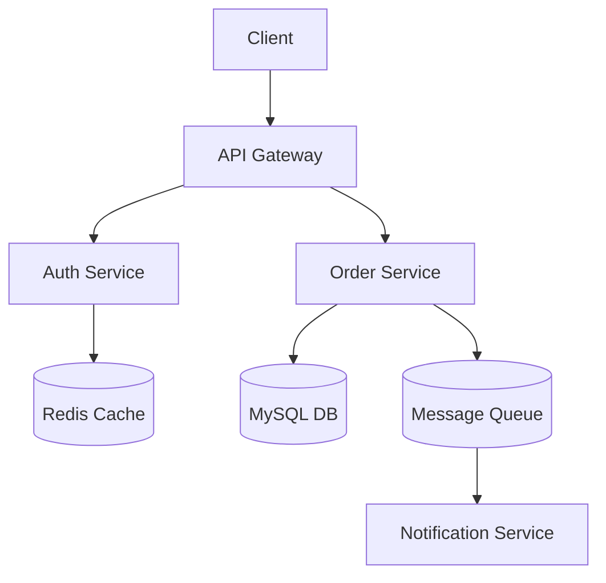

# 系统设计技术文档：构建高可用、可扩展的分布式系统

## 1. 概述

### 1.1 什么是系统设计
系统设计（System Design）是将业务需求转化为技术架构的过程。它涉及选择合适的基础设施、数据模型、算法和接口，以确保系统能够满足功能性需求（如功能实现）和非功能性需求（如性能、可靠性、安全性）。

### 1.2 为什么重要
- **应对规模增长**：随着用户量和数据量的激增，单体架构往往成为瓶颈。
- **保证稳定性**：通过冗余和故障转移机制，确保系统在部分组件失效时仍能运行。
- **降低维护成本**：清晰的分层和模块化解耦，使得系统更易于理解和维护。

### 1.3 适用场景
- 高并发互联网应用（如电商、社交网络）。
- 大数据处理平台。
- 微服务架构迁移。
- 实时通信系统。

```python
# Python 示例：简单的系统设计评估指标类
class SystemMetrics:
    def __init__(self, name: str):
        self.name = name
        self.latency_ms = 0
        self.qps = 0
        self.error_rate = 0.0

    def evaluate(self) -> bool:
        """评估系统是否满足基本SLA"""
        return self.latency_ms < 100 and self.error_rate < 0.01

metrics = SystemMetrics("API_Gateway")
print(f"System {metrics.name} is healthy: {metrics.evaluate()}")
```

---

## 2. 核心概念

### 2.1 可扩展性 (Scalability)
指系统通过增加资源来提升处理能力的特性。分为水平扩展（Scale-out，增加节点）和垂直扩展（Scale-up，增强单节点配置）。

### 2.2 高可用 (High Availability)
通过消除单点故障，确保系统在长时间内持续可用。通常用“几个9”来衡量（如99.99%）。

### 2.3 负载均衡 (Load Balancing)
将 incoming traffic 分发到多个后端服务器，避免单一节点过载。

```go
// Go 示例：简单的轮询负载均衡器
package main

import (
	"fmt"
	"sync"
)

type LoadBalancer struct {
	servers []string
	index   int
	mu      sync.Mutex
}

func NewLoadBalancer(servers []string) *LoadBalancer {
	return &LoadBalancer{servers: servers}
}

func (lb *LoadBalancer) NextServer() string {
	lb.mu.Lock()
	defer lb.mu.Unlock()
	server := lb.servers[lb.index]
	lb.index = (lb.index + 1) % len(lb.servers)
	return server
}

func main() {
	lb := NewLoadBalancer([]string{"server1", "server2", "server3"})
	for i := 0; i < 5; i++ {
		fmt.Println(lb.NextServer())
	}
}
```

### 2.4 缓存 (Caching)
使用高速存储（如 Redis）存放频繁访问的数据，减少数据库压力。

### 2.5 消息队列 (Message Queue)
解耦生产者和消费者，异步处理任务，削峰填谷。

### 2.6 数据库设计
包括范式化与反范式化的权衡，主从复制，分库分表策略。

---

## 3. 设计原则

### 3.1 SOLID 原则
面向对象设计的五大原则，旨在提高代码的可维护性和灵活性。
- **S**ingle Responsibility Principle (单一职责)
- **O**pen/Closed Principle (开闭原则)
- **L**iskov Substitution Principle (里氏替换)
- **I**nterface Segregation Principle (接口隔离)
- **D**ependency Inversion Principle (依赖倒置)

### 3.2 CAP 定理
在分布式系统中，一致性（Consistency）、可用性（Availability）、分区容错性（Partition Tolerance）三者不可兼得，只能选其二。P 是必须的，因此通常在 CP 和 AP 之间做权衡。

### 3.3 BASE 理论
基本可用（Basically Available）、软状态（Soft State）、最终一致性（Eventually Consistent），是对 CAP 中 AP 的延伸，适用于大规模分布式系统。

### 3.4 领域驱动设计 (DDD)
以业务领域为核心，通过限界上下文（Bounded Context）划分模块，促进业务与技术语言的统一。

```java
// Java 示例：体现单一职责原则的接口设计
interface PaymentStrategy {
    boolean pay(double amount);
}

class CreditCardPayment implements PaymentStrategy {
    @Override
    public boolean pay(double amount) {
        // 信用卡支付逻辑
        return true;
    }
}

class PayPalPayment implements PaymentStrategy {
    @Override
    public boolean pay(double amount) {
        // PayPal 支付逻辑
        return true;
    }
}
```

---

## 4. 常见系统设计题

### 4.1 URL 短链服务
**挑战**：如何生成唯一且短的 ID？如何高效重定向？
**方案**：使用 Base62 编码将自增 ID 或雪花算法生成的 ID 转换为短字符串。

```python
# Python 示例：URL 短链生成器
import hashlib
import time

class Shortener:
    BASE62 = "0123456789ABCDEFGHIJKLMNOPQRSTUVWXYZabcdefghijklmnopqrstuvwxyz"
    
    def __init__(self):
        self.url_map = {}
        self.id_counter = 1
    
    def generate_short_url(self, long_url: str) -> str:
        # 简单去重检查
        if long_url in self.url_map:
            return self.url_map[long_url]
        
        # 生成短码
        short_code = self._encode_id(self.id_counter)
        self.id_counter += 1
        
        # 存储映射
        self.url_map[long_url] = short_code
        return f"http://short.ly/{short_code}"
    
    def _encode_id(self, num: int) -> str:
        chars = []
        while num > 0:
            num, remainder = divmod(num, 62)
            chars.append(self.BASE62[remainder])
        return ''.join(reversed(chars))

shortener = Shortener()
print(shortener.generate_short_url("https://www.example.com/very/long/url"))
```

### 4.2 消息系统
**挑战**：消息顺序、重复消费、丢失问题。
**方案**：使用 Kafka/RabbitMQ，结合幂等性设计。

### 4.3 新闻 Feed
**挑战**：如何快速拉取个性化内容？
**方案**：推拉结合（Push-Pull Hybrid）。大V内容主动推送（Fan-out on write），普通用户内容读取时合并（Fan-out on read）。

### 4.4 分布式限流器
**挑战**：防止系统过载。
**方案**：令牌桶或漏桶算法，结合 Redis 实现分布式计数。

```python
# Python 示例：基于滑动窗口的简单限流器
import time
from collections import deque

class RateLimiter:
    def __init__(self, max_requests: int, window_seconds: int):
        self.max_requests = max_requests
        self.window_seconds = window_seconds
        self.requests = deque()
    
    def allow_request(self, client_id: str) -> bool:
        now = time.time()
        # 移除窗口外的请求
        while self.requests and self.requests[0] <= now - self.window_seconds:
            self.requests.popleft()
        
        if len(self.requests) < self.max_requests:
            self.requests.append(now)
            return True
        return False

limiter = RateLimiter(max_requests=5, window_seconds=10)
print(f"Request allowed: {limiter.allow_request('user1')}")
```

---

## 5. 架构图与流程

### 5.1 各层架构设计
典型的分层架构包括：
1. **接入层 (Gateway)**：Nginx/Kong，负责 SSL 终止、路由、限流。
2. **业务逻辑层 (Service)**：微服务集群，处理核心业务。
3. **数据访问层 (DAO)**：ORM 框架，操作数据库。
4. **数据存储层 (Storage)**：MySQL, Redis, MongoDB, Elasticsearch。

### 5.2 数据流设计
1. 客户端发起请求。
2. Gateway 验证 Token 并路由至对应 Service。
3. Service 查询缓存，若未命中则查询 DB。
4. 更新缓存，返回结果。



---

## 6. 性能优化

### 6.1 水平扩展 vs 垂直扩展
- **垂直**：升级 CPU/内存，有上限，成本高。
- **水平**：增加服务器数量，无上限，需解决状态共享问题。

### 6.2 CDN
将静态资源（图片、JS、CSS）分发到边缘节点，减少源站压力，降低延迟。

### 6.3 读写分离
主库写，从库读，减轻主库负载。需注意主从同步延迟。

### 6.4 分库分表
当单库数据量过大（>1000万行）或 QPS 过高时，按规则（如 Hash、范围）拆分数据库和表。

```python
# Python 示例：简单的哈希分片逻辑
def get_shard_key(user_id: int, num_shards: int) -> int:
    return user_id % num_shards

shard_index = get_shard_key(12345, 4)
print(f"User data should be stored in shard: {shard_index}")
```

---

## 7. 最佳实践

### 7.1 生产环境配置建议
- 关闭调试模式。
- 设置合理的连接池大小。
- 使用环境变量管理配置。

### 7.2 监控告警
- 基础设施监控：CPU, Memory, Disk I/O。
- 应用监控：QPS, Latency, Error Rate (RED 方法)。
- 业务监控：订单量, 注册数。

### 7.3 日志收集
使用 ELK (Elasticsearch, Logstash, Kibana) 或 Loki 集中管理日志，便于排查问题。

```go
// Go 示例：结构化日志记录
package main

import (
	"log"
	"os"
)

func logRequest(userID string, action string) {
	log.Printf(`{"level":"info","msg":"request processed","userID":%s,"action":"%s"}`, userID, action)
}

func main() {
	log.SetOutput(os.Stdout)
	logRequest("12345", "login")
}
```

---

## 8. 常见问题与排错

### 8.1 高并发问题
- **现象**：响应慢，超时，崩溃。
- **对策**：异步处理、引入缓存、限流降级、扩容。

### 8.2 数据一致性问题
- **现象**：读写不一致，脏数据。
- **对策**：强一致性（事务），最终一致性（TCC, Saga, 消息队列补偿）。

### 8.3 服务降级
当非核心服务不可用时，返回默认值或友好提示，保护核心业务。

```python
# Python 示例：简单的熔断/降级逻辑
import random

class CircuitBreaker:
    def __init__(self, failure_threshold=5, recovery_timeout=60):
        self.failure_count = 0
        self.failure_threshold = failure_threshold
        self.recovery_timeout = recovery_timeout
        self.last_failure_time = 0
        self.state = "CLOSED"  # CLOSED, OPEN, HALF_OPEN

    def call_service(self):
        if self.state == "OPEN":
            if time.time() - self.last_failure_time > self.recovery_timeout:
                self.state = "HALF_OPEN"
            else:
                return self.fallback()
        
        try:
            # 模拟服务调用
            if random.random() < 0.5:
                raise Exception("Service Error")
            return "Success"
        except Exception as e:
            self.handle_failure()
            return self.fallback()

    def handle_failure(self):
        self.failure_count += 1
        self.last_failure_time = time.time()
        if self.failure_count >= self.failure_threshold:
            self.state = "OPEN"

    def fallback(self):
        return "Default Value (Fallback)"

import time
cb = CircuitBreaker()
print(cb.call_service())
```